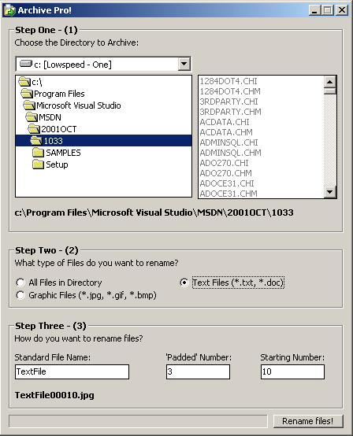



## ArchivePro \- Rename many files\.\.\.

### Description

Simply and efficiently rename all the files of a directory. Select a directory, Choose what type of files to rename (All, Graphic, text), Enter a starting number, Select a number of 'padding' (zero's) and thats it!. Good example of simple error handling, Loop Structures, etc. Nothing too exciting, but it works on Windows 98 - XP. Mail me if you need more functionality.
 
### More Info
 

             |
---                |---
**Submitted On**   |2002-04-20 23:56:52
**By**             |[Chase Gale](https://github.com/Planet-Source-Code/PSCIndex/blob/master/ByAuthor/chase-gale.md)
**Level**          |Intermediate
**User Rating**    |4.7 (33 globes from 7 users)
**Compatibility**  |VB 6\.0
**Category**       |[Files/ File Controls/ Input/ Output](https://github.com/Planet-Source-Code/PSCIndex/blob/master/ByCategory/files-file-controls-input-output__1-3.md)
**World**          |[Visual Basic](https://github.com/Planet-Source-Code/PSCIndex/blob/master/ByWorld/visual-basic.md)
**Archive File**   |[ArchivePro741274212002\.zip](https://github.com/Planet-Source-Code/chase-gale-archivepro-rename-many-files__1-33994/archive/master.zip)

### API Declarations

None... Not proud of it, but none the same. =)

